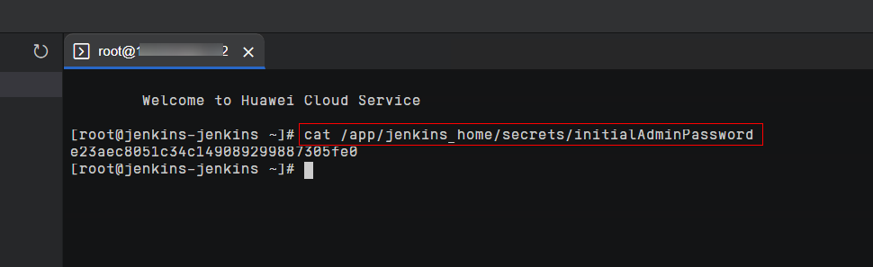

[TOC]

**Solution Overview**
===============
This solution helps you quickly deploy source code compilation environments on Elastic Cloud Server (ECS). With the elastic scaling of ECS and the persistency of Jenkins, this solution helps you quickly and inexpensively deploy complex compilation environments, greatly improving the efficiency of software deployment. Jenkins is an open-source continuous integration tool written in Java. It aims to provide an open and easy-to-use software platform for continuous integration of software projects. Gerrit is a web-based code review tool built on top of the git version control system. It aims to provide a lightweight framework for reviewing every commit before it is accepted into the code base.

**Architecture**
---------------


**Architecture Description**
---------------
This solution will:
1. Create two ECSs, one for the Gerrit code repository and one for the Jenkins master node.
2. Configure compilation nodes and configure Huawei Cloud plug-ins on the Jenkins master node to dynamically create and release ECS compilation nodes.
3. Create an Object Storage Service (OBS) bucket to store compilation results.

You can use Image Management Service (IMS) to prepare the OS environment required for compilation in advance.

**File Structure**
---------------

``` lua
huaweicloud-solution-deploy-a-source-code-build-system-based-on-jenkins
├── deploy-a-source-code-build-system-based-on-jenkins.tf.json -- Resource orchestration template
├── userdata
    ├── install_gerrit.sh  -- Install the Gerrit code repository
	├── install_jenkins.sh  -- Install Jenkins
```
**Getting Started**
---------------
***Accessing Gerrit and Creating a Code Repository***

1. On the Outputs tab of the stack, copy the Gerrit access address.

	Figure 1 Gerrit access address
	

2. Paste the Gerrit access address to the address bar of a browser and click **Sign in**.

	Figure 2 Accessing Gerrit
	

3. Click **Sign in with a Launchpad ID**.

	Figure 3 Signing in to Gerrit (1)
	

4. On the Ubuntu One page, enter an email address and password to log in. (If you do not have an account, click **Log in or Create account** in the upper right corner to create an account.)

	Figure 4 Signing in to Gerrit (2)
	

5. On the displayed page, click Yes, log me in.

	Figure 5 Signing in to Gerrit (3)
	

6. Choose **BROWSE** > **Repositories** > **CREATE NEW**, specify **Repository name** and **Default Branch**, and click **CREATE**.

	Figure 6 Creating a code repository
	


***Accessing Jenkins***

1. In the ECS list on the  [Elastic Cloud Server (ECS)](https://console-intl.huaweicloud.com/ecm/?agencyId=WOmAijZnbElNjCFzTVDl4aJQAgdaTUMD&locale=en-us&region=ap-southeast-3#/ecs/dashboard) console, click the created Jenkins server.

	Figure 7 Accessing the Jenkins server
	

2. Click **Remote Login**. In the displayed dialog box, click **Log In** in the **CloudShell-based Login** area.

	Figure 8 Logging in to the Jenkins server
	

3. After the connection is set up, run **cat /app/jenkins_home/secrets/initialAdminPassword** to obtain the login password of user **admin** and copy the password.

	Figure 9 Obtaining the password of user admin for logging in to the Jenkins server
	

4. On the **Outputs** tab of the stack, obtain the Jenkins access address.

	Figure 10 Jenkins access address
	

5. [Configure the HuaweiCloud ECS plugin](https://plugins.jenkins.io/huaweicloud-ecs/#documentation) to automatically create Huawei Cloud ECSs as the slave nodes of the Jenkins cluster.

Refer to the [deployment guide](https://support.huaweicloud.com/intl/en-us/dscbsbj-ctf/dscbsbj_01.html) for more information.

